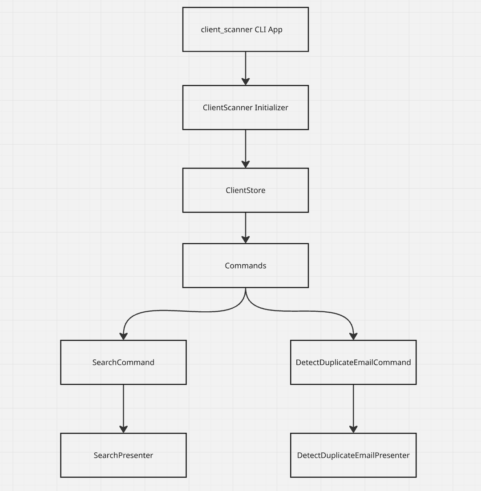

# ClientScanner CLI Application

`client_scanner` is a command line application built in ruby for searching clients by name and detecting email duplicates from a JSON dataset.

## Features

- Search clients by name
- Detect email duplicates in a JSON dataset

## Architecture

The architecture follows key design patterns:

- **Stores** for data access
- **Commands Pattern** for finding name and duplicates email
- **Presenter Pattern** for formatting output

## Component Diagram



## Assumption:

- **PII Data in `clients.json`**: The `data/clients.json` contains PII data, including users full name and email. I have assumed that the dataset with PII is safe to share for technical challenge and has been committed for Git for the purpose of the application. For real applications I would not have committed it to git and rather use other measures such as encrypt files or upload in database/s3 depending on use case to handle sensitive information. Similar case for specs as well, where I would rather use factories with fakers for test data.
- **Ruby language**: The application is developed in ruby and requires ruby 3.4.2+ to execute. The gem also depends on `bundler` to manage dependencies.
- **Performance**: The application is designed for moderate sized datasets. For very large datasets, optimizations may be required to improve performance.
- **Error handling**: The application puts errors, rather than using logging framework. In real application, better logging framework is advisable for observability.
- **Single Dataset**: The `client_scanner` works with a single dataset. To work with multiple datasets, further enhancements to the application is required.

## Usage

1. Clone the repository

```
git clone https://github.com/RORingBBK/client_scanner.git
```

2. From root directory on `client_scanner`, install dependencies using bundler

```
bundle install
```

3. Add executable permission for `./bin/client_scanner`

```
chmod +x ./bin/client_scanner
```

4. Searching clients by name

```
bin/client_scanner -s Liam
```

5. Detecting email duplicates

```
bin/client_scanner -e jane.smith@yahoo.com
```

## Testing

To run tests, use RSpec:

```
bundle exec rspec
```

## Rubocop

To run rubocop:

```
bundle exec rubocop
```

## Architecture Decision Records

1. [System Architecture](https://github.com/RORingBBK/client_scanner/blob/main/docs/system_architecture.md)
2. [Git Workflow](https://github.com/RORingBBK/client_scanner/blob/main/docs/git_workflow.md)

## Contributing

Bug reports and pull requests are welcome on GitHub at https://github.com/roringbbk/client_scanner. This project is intended to be a safe, welcoming space for collaboration, and contributors are expected to adhere to the [code of conduct](https://github.com/roringbbk/client_scanner/blob/main/CODE_OF_CONDUCT.md).

1. Fork the repository
2. Create a new branch (example: `git checkout -b feature/your-feature`)
3. Make your changes
4. Commit your changes
5. Push to the branch
6. Create a pull request to `main`

## License

The gem is available as open source under the terms of the [MIT License](https://opensource.org/licenses/MIT).

## Code of Conduct

Everyone interacting in the ClientScanner project's codebases, issue trackers, chat rooms and mailing lists is expected to follow the [code of conduct](https://github.com/roringbbk/client_scanner/blob/main/CODE_OF_CONDUCT.md).
